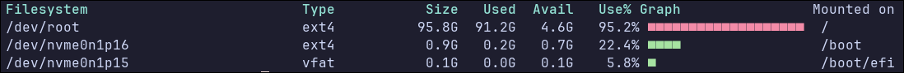

# df-rust

A minimalist `df` clone written in Rust — displays mounted filesystems, disk
usage, and colored usage bars in a clean column layout.

 <!-- Optional if you add one -->

## Features

- Parses `/proc/mounts` directly — no shelling out or external binaries
- Uses `libc::statvfs` for disk statistics (no extra crates)
- Filters out pseudo-filesystems (`proc`, `tmpfs`, `sysfs`, etc.)
- Displays:
  - Filesystem device
  - Total, used, available space
  - Usage percentage
  - Colored bar graph (■) indicating usage level
- ANSI color output with clear thresholds:
  - **Green**: < 75%
  - **Yellow**: 75–85%
  - **Red**: > 85%

## Output Example

```bash
Filesystem         Type     Size   Used  Avail   Use% Graph             Mounted on
/dev/nvme0n1p2     btrfs  930.5G  85.6G 845.0G    9.2% ■■                /
/dev/nvme0n1p1     vfat     1.0G   0.2G   0.8G   22.1% ■■■■              /boot
```

## Building

Make sure you have Rust installed. Then:

```bash
git clone https://github.com/codemonkey76/df-rust.git
cd df-rust
cargo build --release
```

## Usage

Run:

```bash

./target/release/df-rust
```

Or install to your path:

```bash
cargo install --path .
```
